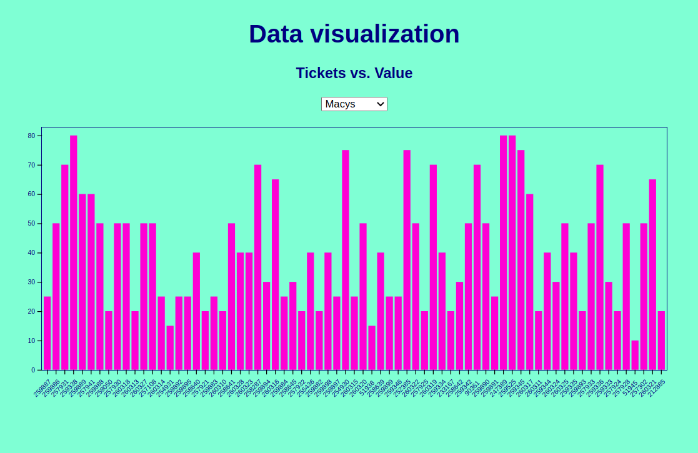

# data_visualization
This project is an interactive Vue and D3.js app that fetches data from a JSON file and displays data on a Chart component (Vue), it includes a selector that allows the user to filter the required data displayed on the chart.

This is a dockerized app so you can launch using Docker



## Launch with Docker
```shell
docker-compose up
```

## Project setup
```shell
npm install
```

### Compiles and hot-reloads for development
```shell
npm run serve
```

### Compiles and minifies for production
```shell
npm run build
```

### Lints and fixes files
```shell
npm run lint
```

### Customize configuration
See [Configuration Reference](https://cli.vuejs.org/config/).
